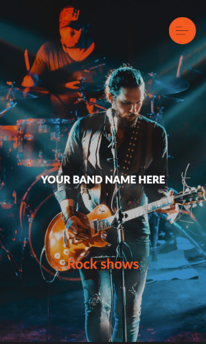
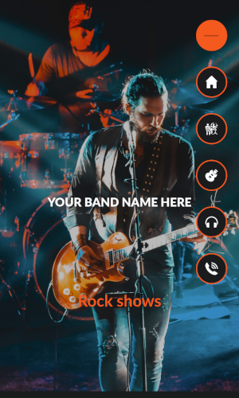

# :trollface: Free Rock Band Website Template :guitar:

<p align="center">
  
</p>
<p align="center">
  
</p>
<p align="center"># Banda Web — Microservicio 1

Web pública de la banda + sistema de suscripción de emails.
**Stack**: FastAPI · MongoDB (Azure Cosmos DB) · Docker · Azure Container Apps

---

## Estructura del proyecto

```
banda-web/
├── frontend/
│   └── index.html              ← Web pública (HTML/CSS/JS)
├── backend/
│   ├── main.py                 ← FastAPI app
│   ├── database.py             ← Conexión MongoDB
│   ├── models.py               ← Modelos Pydantic
│   ├── routers/
│   │   └── subscribers.py      ← Endpoints de suscripción
│   ├── requirements.txt
│   └── .env.example
├── Dockerfile
├── docker-compose.yml
└── .github/
    └── workflows/
        └── deploy.yml          ← CI/CD automático
```

---

## Desarrollo local

### 1. Requisitos
- Docker Desktop instalado
- Git

### 2. Clonar y configurar

```bash
git clone https://github.com/tu-usuario/banda-web.git
cd banda-web

# Copia y edita las variables de entorno
cp backend/.env.example backend/.env
```

### 3. Levantar todo con Docker Compose

```bash
docker compose up --build
```

Esto levanta:
- **http://localhost:8000** → Web pública + API
- **http://localhost:8000/api/docs** → Swagger UI (documentación interactiva)
- **http://localhost:8081** → Mongo Express (ver la base de datos en el browser)

### 4. Probar la suscripción

```bash
curl -X POST http://localhost:8000/api/v1/subscribe \
  -H "Content-Type: application/json" \
  -d '{"email": "fan@ejemplo.com", "source": "web"}'
```

### 5. Ver suscriptores (requiere API key)

```bash
curl http://localhost:8000/api/v1/subscribers \
  -H "x-api-key: dev-key-123"
```

---

## Despliegue en Azure — paso a paso

### Paso 1: Instalar Azure CLI

```bash
# macOS
brew install azure-cli

# Windows (PowerShell como admin)
winget install Microsoft.AzureCLI

# Linux
curl -sL https://aka.ms/InstallAzureCLIDeb | sudo bash
```

### Paso 2: Login y crear recursos en Azure

```bash
az login

# Variables (cámbialas por los nombres que quieras)
RESOURCE_GROUP="banda-rg"
LOCATION="eastus"
ACR_NAME="bandaacr"                    # debe ser único globalmente
COSMOS_ACCOUNT="banda-cosmos"
CONTAINER_ENV="banda-env"
CONTAINER_APP="banda-web"

# 1 — Resource Group
az group create --name $RESOURCE_GROUP --location $LOCATION

# 2 — Azure Container Registry
az acr create \
  --name $ACR_NAME \
  --resource-group $RESOURCE_GROUP \
  --sku Basic \
  --admin-enabled true

# 3 — Cosmos DB con API MongoDB
az cosmosdb create \
  --name $COSMOS_ACCOUNT \
  --resource-group $RESOURCE_GROUP \
  --kind MongoDB \
  --server-version 7.0 \
  --default-consistency-level Session

az cosmosdb mongodb database create \
  --account-name $COSMOS_ACCOUNT \
  --resource-group $RESOURCE_GROUP \
  --name banda_web

# Obtener la cadena de conexión (guárdala, la necesitarás)
az cosmosdb keys list \
  --name $COSMOS_ACCOUNT \
  --resource-group $RESOURCE_GROUP \
  --type connection-strings

# 4 — Container Apps Environment
az containerapp env create \
  --name $CONTAINER_ENV \
  --resource-group $RESOURCE_GROUP \
  --location $LOCATION
```

### Paso 3: Primera subida manual de la imagen

```bash
# Build y push a tu registry
az acr login --name $ACR_NAME

docker build -t $ACR_NAME.azurecr.io/banda-web:latest .
docker push $ACR_NAME.azurecr.io/banda-web:latest
```

### Paso 4: Crear la Container App

```bash
# Obtén las credenciales del registry
ACR_PASSWORD=$(az acr credential show --name $ACR_NAME --query passwords[0].value -o tsv)

# Reemplaza MONGODB_CONNECTION_STRING con la cadena que obtuviste en el paso anterior
az containerapp create \
  --name $CONTAINER_APP \
  --resource-group $RESOURCE_GROUP \
  --environment $CONTAINER_ENV \
  --image $ACR_NAME.azurecr.io/banda-web:latest \
  --registry-server $ACR_NAME.azurecr.io \
  --registry-username $ACR_NAME \
  --registry-password $ACR_PASSWORD \
  --target-port 8000 \
  --ingress external \
  --min-replicas 0 \
  --max-replicas 3 \
  --env-vars \
      MONGODB_URI="MONGODB_CONNECTION_STRING" \
      MONGODB_DB="banda_web" \
      ADMIN_API_KEY="pon-aqui-una-clave-secreta-segura" \
      ALLOWED_ORIGINS="https://tu-dominio.com" \
      FRONTEND_DIR="/app/frontend"

# Obtener la URL pública
az containerapp show \
  --name $CONTAINER_APP \
  --resource-group $RESOURCE_GROUP \
  --query properties.configuration.ingress.fqdn -o tsv
```

### Paso 5: Configurar CI/CD con GitHub Actions

**a)** Crear un Service Principal para que GitHub pueda desplegar en Azure:

```bash
az ad sp create-for-rbac \
  --name "banda-web-github" \
  --role contributor \
  --scopes /subscriptions/$(az account show --query id -o tsv)/resourceGroups/$RESOURCE_GROUP \
  --sdk-auth
```
Copia el JSON que devuelve.

**b)** En GitHub → tu repo → Settings → Secrets and variables → Actions, crea estos secrets:

| Secret | Valor |
|--------|-------|
| `AZURE_CREDENTIALS` | El JSON completo del paso anterior |
| `ACR_LOGIN_SERVER` | `bandaacr.azurecr.io` |
| `ACR_USERNAME` | `bandaacr` |
| `ACR_PASSWORD` | La contraseña del registry |
| `AZURE_RESOURCE_GROUP` | `banda-rg` |
| `CONTAINER_APP_NAME` | `banda-web` |

**c)** A partir de ahora, cada `git push` a `main` despliega automáticamente. ✅

---

## Endpoints de la API

| Método | Ruta | Descripción | Auth |
|--------|------|-------------|------|
| `GET` | `/api/health` | Health check | No |
| `POST` | `/api/v1/subscribe` | Registrar suscriptor | No |
| `GET` | `/api/v1/subscribers` | Listar suscriptores | API Key |
| `DELETE` | `/api/v1/unsubscribe?email=x` | Dar de baja | No |
| `GET` | `/api/docs` | Swagger UI | No |

---

## Variables de entorno

| Variable | Descripción | Ejemplo |
|----------|-------------|---------|
| `MONGODB_URI` | Cadena de conexión MongoDB | `mongodb://...` |
| `MONGODB_DB` | Nombre de la base de datos | `banda_web` |
| `ADMIN_API_KEY` | Clave para endpoints de admin | `clave-secreta` |
| `ALLOWED_ORIGINS` | Dominios permitidos CORS | `https://tubanda.com` |
| `FRONTEND_DIR` | Ruta del frontend en el contenedor | `/app/frontend` |

---

## Costos estimados en Azure (tier inicial)

| Servicio | Plan | Costo estimado |
|----------|------|----------------|
| Container Apps | Consumption (free tier) | ~$0/mes con poco tráfico |
| Cosmos DB | Free tier (1000 RU/s) | $0/mes |
| Container Registry | Basic | ~$5/mes |
| **Total** | | **~$5/mes para empezar** |
  
</p>


:point_right:[Show webpage here](https://gtcore902.github.io/free-rock-band-website-template/):metal:

## :free: You can use this template for your Rock Band web site !

### How to ?

:one:
```
mkdir <your directory>
git clone https://github.com/gtcore902/free-rock-band-website-template.git
```

:two: Updates in 'index.html' :
* 'alt' attributes for img tags
* input your band name in place of < your band name here >
* your band name in h1 / h2 tags
* your clip and clip name in video tag

:three: Update 'mainFunctions.js' file to input email address (line 55 / 56).

:four: To update yours social network accounts, modify lines 316 / 322 / 326 in the same file.

:five: Then you need to update these variables in 'sendFormContact.php' in your code editor to use form sections:
* $texte = "your site name" (line 11)
* $destinataire = "your email"
* $objet = "your band name"
* line 19 = "email from to send form" (you can choose any)
* $conf = "yours smtp informations"

:six: Do the same actions in 'sendFormSubscription.php' file.

That's all:exclamation:
Deploy this code on your server.

### :sunglasses: Want to contribute :question:

Fork this repository :stuck_out_tongue_winking_eye:
```
mkdir <your directory>
git clone https://github.com/gtcore902/free-rock-band-website-template.git
git checkout -b newfeature
git commit -am 'your feature'
git push origin newfeature
```
# TuNoEresElReyDelTrenFantasma
